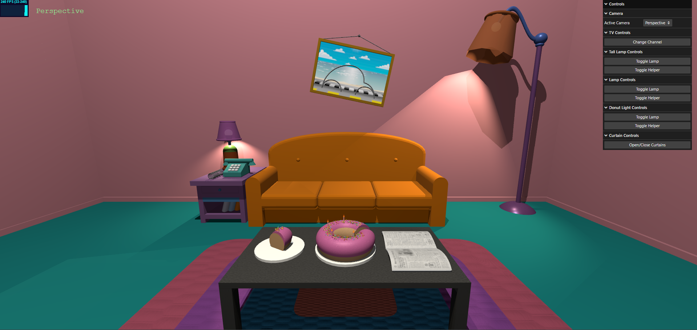
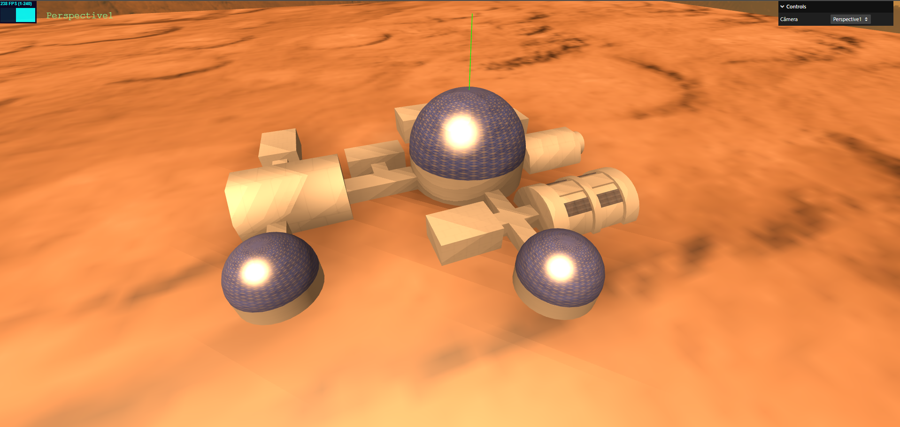

# SGI 2024/2025

## Group T03G03
| Name             | Number    | E-Mail             |
| ---------------- | --------- | ------------------ |
| Rodrigo Esteves  | 202403070 | up202403070@up.pt  |
| Pedro Cancela    | 202400230 | up202400230@up.pt  |

----

## Projects

### [TP1 - ThreeJS Basics - The Simpsons's Living Room](tp1)

### Project Overview

This project features a 3D interactive scene inspired by the living room from *The Simpsons*. It showcases various modeling, texturing, and lighting techniques.

[View the scene](tp1/index.html)

### Key Features

- **Multiple Camera Views**: Switch between different perspectives.
- **3D Objects**: Includes sofas, lamps, tables, and decorative elements.
- **Realistic Textures**: Wood floors, patterned walls, and fabric textures.
- **Dynamic Lighting**: Spotlights and ambient lighting for realistic shadows.
- **Interactive GUI**: Control camera views, lighting, and object properties.

### Elements

- Decorative **Flower Jars**
- Functional **TV** with channel controls
- **Creator Canvases** featuring the scene creators
- **Textured Rug** and **Table**
- Iconic **Donut**
- NURBS **Newspaper**
- Custom **Sofa** design
- **Directional Lamps**
- **Window** simulating sunlight
- **Sliding Curtains**
- **Vase** for decor

### Screenshots

### Issues

- **Unimplemented Features**: Missing textures in some objects.
- **Bugs**: Imperfect shadows despite good map size.

-----

### [TP2 - Scene Graph - Base on Mars](tp2)
### Project Overview
This project is a 3D interactive scene simulating a **Base on Mars**, created by using the Scene Graph tecnique

[View the scene](tp2/index.html)

### Key Features

- **Multiple Camera Views**: Toggle between different camera perspectives for dynamic scene exploration.
- **3D Objects and Geometry**: The scene includes diverse structures such as domes, cylindrical modules, and connecting corridors, designed to represent a functional Mars habitat.
- **Materials and Textures**: Use of reflective materials for the domes, textured surfaces for the Mars terrain, and detailed solar panels to enhance realism.
- **Lighting and Shadows**: A carefully crafted lighting setup, including directional lights to simulate the sun, creates realistic shadows and highlights key structures.
- **Interactive GUI**: A user-friendly interface to control camera views and enable wireframe mode some objects.

### Elements
  - **Domes**
  - **Cylindrical Modules**
  - **Solar Panels**
  - **Poles with Lights**
  - **Portuguese Flag**

### Screenshots

### Issues / Problems
- **Unimplemented Features**: Lighting in the poles scattered around the base
- **Bugs**: Texture Repeat in some cases does not work as intended.
----
### [TP3 - Development of a game - Hot Air Balloon Race](tp3)
### Project Overview

This project is a 3D game developed using the THREE.JS library. The game features a **Hot Air Balloon Race**, combining interactive gameplay with visually immersive elements.

[View the scene](tp3/index.html)

### Key Features

- **Multiple Camera Views**: Players can switch between First-Person and Third-Person perspectives by pressing the 'V' key.
- **Interactive Menu**: A menu interface designed with spritesheets and object picking.
- **Customizable Models**: Various hot air balloon models are available for players and AI opponents.
- **Timestamps**: At the end of the race, players can view their best lap time and total elapsed time.
- **Collisions**: Interacting with certain objects can provide benefits or penalties:
  - **Power-ups**: Gain a voucher upon collision.
  - **Obstacles**: Receive a 1-second penalty if no vouchers are available.

### Elements

  - **Player's Balloon & Bot Balloon** 
  - **Menu**
  - **Power-ups & Obstacles**
  - **Track**

### Screenshots

### Issues / Problems

- **Unimplemented Features**: The **Leaderboard** and the **Shaders** feature is not yet implemented.
- **Bugs**: Occasionally, the verification system may fail to detect whether the balloon is inside the track.
- **Performance Issues**: Performance may vary depending on the system. Disabling shadows can help improve performance.