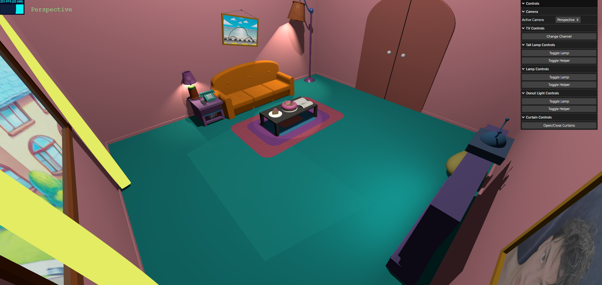
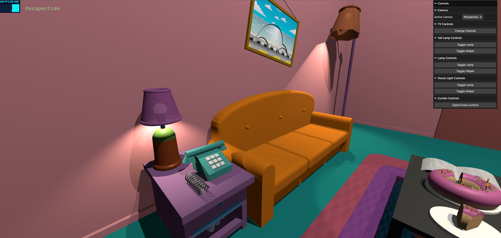
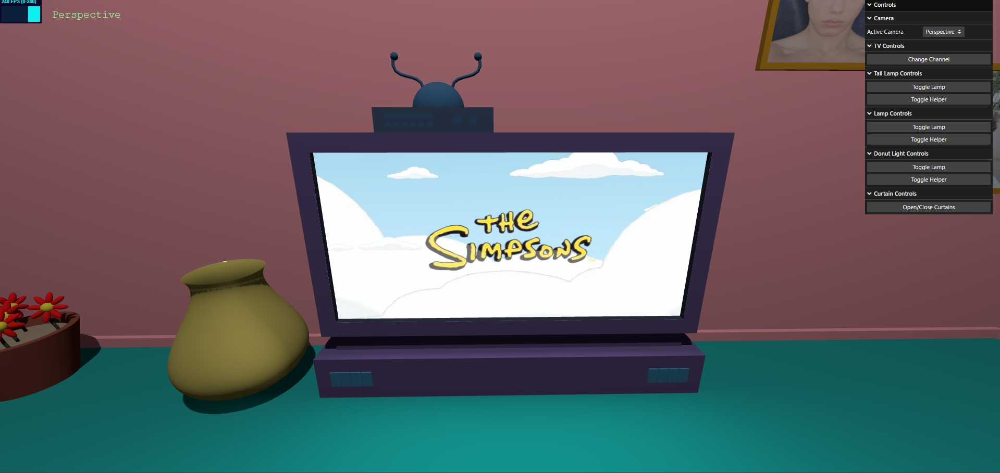
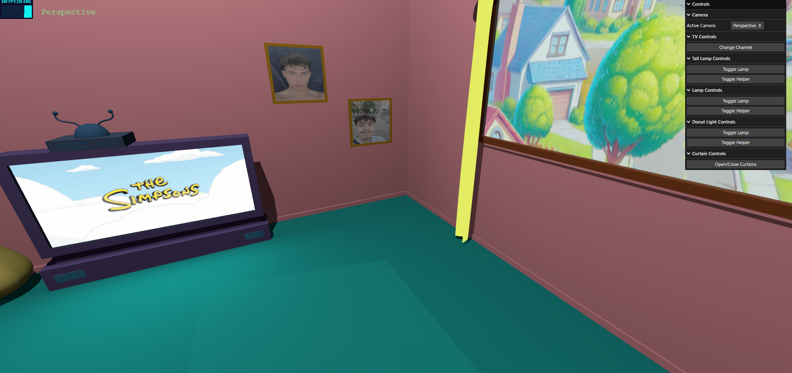

# SGI 2024/2025 - TP1

## Group T03G03
| Name             | Student ID | Email                    |
| ---------------- | ---------- | ------------------------ |
| Rodrigo Esteves  | 202403070  | up202403070@up.pt       |
| Pedro Cancela    | 202400230  | up202400230@up.pt       |

---

## Project Information

This project is a 3D interactive scene, inspired by the living room from *The Simpsons*, showcasing a variety of modeling, texturing, and lighting techniques. The project demonstrates the following features:

### Key Features

- **Multiple Camera Views**: Toggle between different camera perspectives for dynamic scene exploration.
- **3D Objects and Geometry**: The scene includes complex objects like sofas, lamps, tables, and small decorative elements, built from basic shapes like cubes, cones, and planes.
- **Materials and Textures**: Use of various materials and textures to bring realism to surfaces, from the wooden floor to patterned walls and fabric textures.
- **Lighting and Shadows**: A carefully configured lighting setup, including spotlights and ambient lighting, creates realistic shadows and highlights key objects.
- **Interactive GUI**: A user interface to control elements such as camera views, lighting, and specific object properties for a customizable experience.

### Elements

- **Flower Jars**: One decorative flower jars add a touch of color and realism to the room.
- **TV with Channel Controls**: A functional TV where users can change channels, with light emitted to simulate a realistic screen glow.
- **Creator Canvases**: Two framed canvas artworks featuring images of the scene creators.
- **Textured Rug and Table**: The rug and table are designed with custom textures to bring depth and style to the lounge area.
- **Iconic Donut**: A pink-frosted donut with sprinkles and a slice cut out, adding a nod to *The Simpsons* and visual interest on the table.
- **NURBS Newspaper**: A detailed newspaper created using NURBS modeling techniques.
- **Custom-Shaped Sofa**: A unique sofa design built with custom shapes to replicate the iconic *Simpsons* sofa.
- **Directional Lamps**: Several lamps are placed strategically, each using directional lighting to highlight different areas in the room.
- **Curved Spring**: A spring created with curves.
- **Window with Sunlight Simulation**: A large window that brings in simulated sunlight using directional light to create a natural ambiance.
- **Sliding Curtains**: Two curtains made with NURBS, designed to slide open and close, allowing users to control light exposure.
- **Vase**: Decorative Vase
---
## Screenshots

---

## Issues / Problems

- *Unimplemented Features*: 
  - Missing textures in some objects.
- *Bugs*: 
  - Some shadows are not perfect even with a good map size.
- *Performance Issues*: 
  - N/A
- *Other Problems*: 
  - N/A

---

This README provides a structured overview of the project, highlighting the 3D modeling and real-time interactive elements that were implemented.
