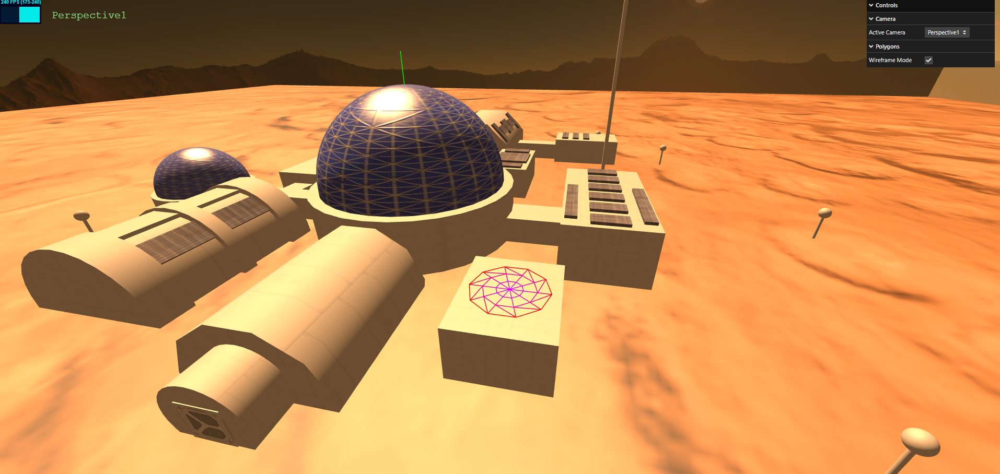
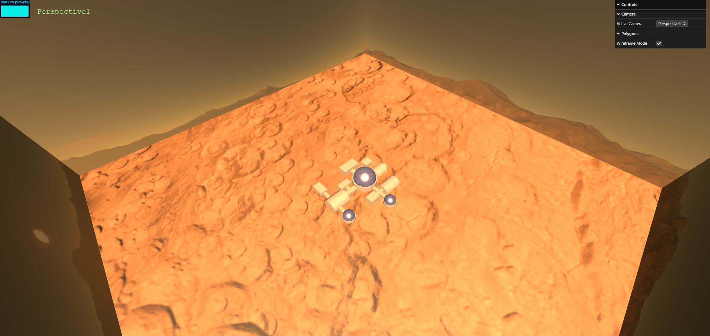

## Group T03G03
| Name             | Student ID | Email                    |
| ---------------- | ---------- | ------------------------ |
| Rodrigo Esteves  | 202403070  | up202403070@up.pt       |
| Pedro Cancela    | 202400230  | up202400230@up.pt       |

---

## Project Information

This project is a 3D interactive scene simulating a base on mars, created by using the Scene Graph tecnique

### Key Features

- **Multiple Camera Views**: Toggle between different camera perspectives for dynamic scene exploration.
- **3D Objects and Geometry**: The scene includes diverse structures such as domes, cylindrical modules, and connecting corridors, designed to represent a functional Mars habitat.
- **Materials and Textures**: Use of reflective materials for the domes, textured surfaces for the Mars terrain, and detailed solar panels to enhance realism.
- **Lighting and Shadows**: A carefully crafted lighting setup, including directional lights to simulate the sun, creates realistic shadows and highlights key structures.
- **Interactive GUI**: A user-friendly interface to control camera views and enable wireframe mode some objects.

### Elements
- **Mars Base**: The base includes structures of different shapes and purposes:
  - **Domes**: Large spherical structures with a triangular lattice pattern, possibly used as greenhouses or living areas.
  - **Cylindrical Modules**: Horizontal, tube-like buildings serving as connectors or technical spaces.
  - **Solar Panels**: Integrated into the architecture.
  - **Poles with Lights**: Small decorative poles scattered around the base for lighting.
  - **Portuguese Flag**: Representing an international effort in space exploration.

- **Landscape**: A Mars-like terrain with realistic textures, featuring a dusty surface, craters, and distant mountains as a backdrop.

---
## Screenshots

---

## Issues / Problems

- *Unimplemented Features*: 
  - Lighting in the poles scattered around the base
- *Bugs*: 
  - Texture Repeat in some cases does not work as intended.
- *Performance Issues*: 
  - N/A
- *Other Problems*: 
  - N/A

---

This README provides a structured overview of the project, highlighting the 3D modeling and real-time interactive elements that were implemented.