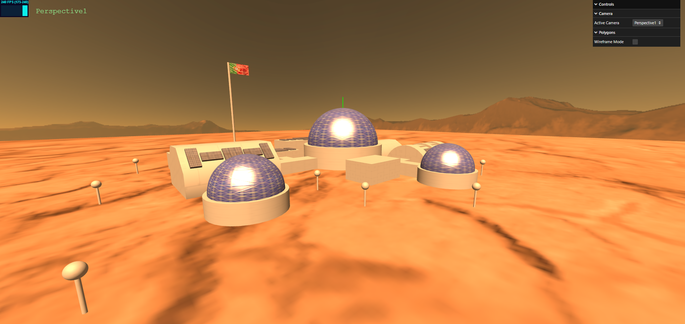

## Group T03G03
| Name             | Student ID | Email                    |
| ---------------- | ---------- | ------------------------ |
| Rodrigo Esteves  | 202403070  | up202403070@up.pt       |
| Pedro Cancela    | 202400230  | up202400230@up.pt       |

---

## Project Information

This project is a 3D interactive scene simulating a base on mars, created by using the Scene Graph tecnique

### Key Features

- **Multiple Camera Views**: Toggle between different camera perspectives for dynamic scene exploration.
- **3D Objects and Geometry**: The scene includes complex objects like sofas, lamps, tables, and small decorative elements, built from basic shapes like cubes, cones, and planes.
- **Materials and Textures**: Use of various materials and textures to bring realism to surfaces, from the wooden floor to patterned walls and fabric textures.
- **Lighting and Shadows**: A carefully configured lighting setup, including spotlights and ambient lighting, creates realistic shadows and highlights key objects.
- **Interactive GUI**: A user interface to control elements such as camera views, lighting, and specific object properties for a customizable experience.

### Elements
- **Mars Base**: Multiple house and domes to simulate a base in mars

---
## Screenshots

---

## Issues / Problems

- *Unimplemented Features*: 
  - LODS
  - MipMaps, Bump-textures, Video-textures
  - Wireframe visualisation
  - Buffer Geometry
- *Bugs*: 
  - Texture Repeat
- *Performance Issues*: 
  - N/A
- *Other Problems*: 
  - N/A

---

This README provides a structured overview of the project, highlighting the 3D modeling and real-time interactive elements that were implemented.