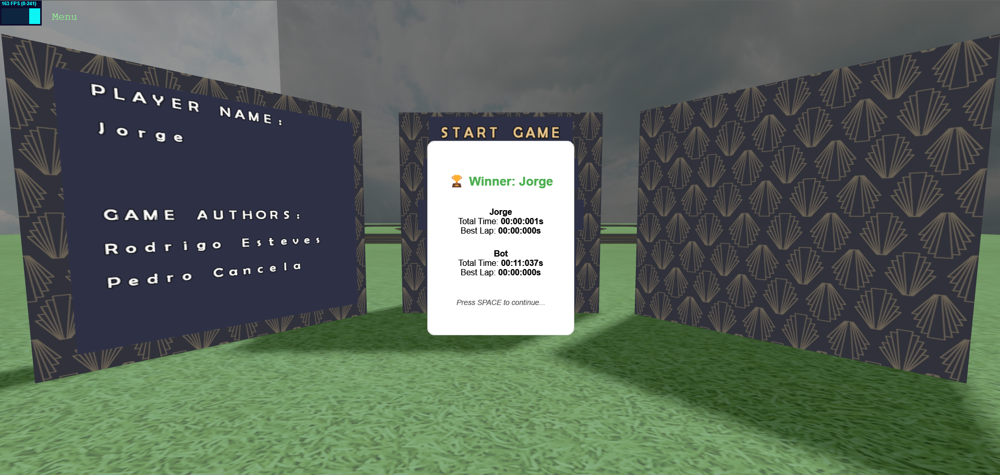

# SGI 2024/2025 - TP3

## Group T03G03

| Name             | Student ID | Email                   |
| ----------------- | ---------- | ----------------------- |
| Rodrigo Esteves   | 202403070  | up202403070@up.pt       |
| Pedro Cancela     | 202400230  | up202400230@up.pt       |

---

## Project Overview

This project is a 3D game developed using the THREE.JS library. The game features a **Hot Air Balloon Race**, combining interactive gameplay with visually immersive elements.

### Key Features

- **Multiple Camera Views**: Players can switch between First-Person and Third-Person perspectives by pressing the 'V' key.
- **Interactive Menu**: A menu interface designed with spritesheets and object picking.
- **Customizable Models**: Various hot air balloon models are available for players and AI opponents.
- **Timestamps**: At the end of the race, players can view their best lap time and total elapsed time.
- **Collisions**: Interacting with certain objects can provide benefits or penalties:
  - **Power-ups**: Gain a voucher upon collision.
  - **Obstacles**: Receive a 1-second penalty if no vouchers are available.

### Elements

- **Scene**: The core game environment includes:
  - **Player's Balloon**: A realistic 3D hot air balloon model.
  - **Bot Balloon**: The AI-controlled opponent's balloon.
  - **Menu**: A simple and interactive menu interface.
  - **Power-ups**: Structures that grant vouchers upon collision.
  - **Obstacles**: Structures that impose a 1-second penalty if no vouchers are held by the player.
  - **Track**: A racecourse modeled using a Catmull-Rom spline for smooth paths.

- **Landscape**: A visually appealing backdrop with a skybox and textured ground.

---

## Screenshots

  
  
  
  
  
  
  

---

## Issues / Problems

- **Unimplemented Features**:  
  - The **Leaderboard** feature is not yet implemented.
- **Bugs**:  
  - Occasionally, the verification system may fail to detect whether the balloon is inside the track.
- **Performance Issues**:  
  - Performance may vary depending on the system. Disabling shadows can help improve performance.
- **Other Problems**:  
  - None identified.

---

This README provides a structured and detailed overview of the project, emphasizing the integration of 3D modeling, interactive gameplay mechanics, and real-time rendering.
